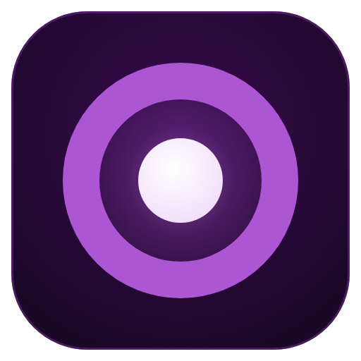
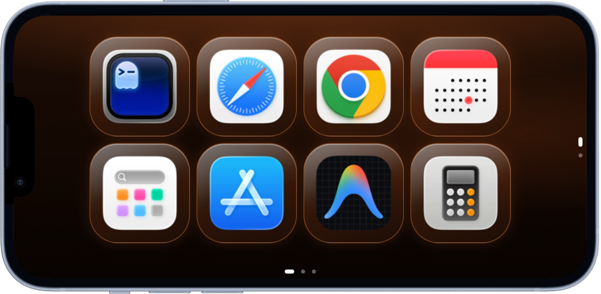

<p align="center">
  
</p>

<h1 align="center">Lumen</h1>

<p align="center"><a href="README.en.md">Read this README in English</a></p>

<p align="center">
  <b>Dock de apps que sincroniza do Mac pra qualquer device na LAN.</b><br>
  Nasceu de um Galaxy J5 velho parado em casa — hoje roda em qualquer Android, iPhone ou navegador.
</p>

<p align="center">
  
  
  
  
  
  
  
</p>

Gerenciador de dock de apps — controle seus apps fixados de qualquer dispositivo.

A ideia nasceu de um Galaxy J5 velho parado em casa. A vontade era fazer algo útil com ele, e nasceu o Lumen: um sistema de dock que sincroniza apps entre um Mac e qualquer dispositivo com navegador (qualquer Android, iPhone, outro Mac).

<p align="center">
  
</p>

## Instalação

Para instalar sem terminal, abra a [página de instalação](https://lumen.vercel.app/).

### Mac — host principal

[Baixar os releases do Lumen](https://github.com/hribeirojob/Lumen/releases/latest) e escolha o pacote para seu Mac: `Lumen-macOS-apple-silicon-arm64.dmg` para Apple Silicon (M1, M2, M3 ou M4) ou `Lumen-macOS-intel-x86_64.dmg` para Intel. Abra o `.dmg`, arraste o Lumen para Aplicativos e abra o app.

O Mac é o host: ele executa o servidor e disponibiliza o dock para os outros dispositivos na mesma rede.

> **Se o macOS bloquear a primeira abertura:** abra **Ajustes do Sistema →
> Privacidade e Segurança → Segurança → Abrir Mesmo Assim → Abrir**. Essa
> confirmação é necessária porque o Lumen é distribuído fora da App Store.

### Android

[Baixar o APK](https://github.com/hribeirojob/Lumen/releases/latest/download/lumen.apk) e instalar. Depois, abra o Lumen no Mac e use o link e o PIN exibidos na aba **Conectar** para conectar o celular.

Atalhos funcionam por padrão em HTTP para dispositivos autenticados na mesma sub-rede Ethernet/Wi-Fi do Mac, incluindo o APK. O tráfego não é criptografado. Para executar atalhos fora dela, use uma URL HTTPS.

### iPhone

O iPhone usa a PWA pelo navegador. Abra o link exibido na aba **Sobre** no Safari e escolha **Adicionar à Tela de Início**. O iPhone exige uma URL HTTPS; a página de instalação explica o caminho atual.

No iPhone, use HTTPS para executar atalhos fora da rede local.

> Windows ainda não está disponível. O botão aparecerá na página quando houver uma versão instalável.

## Como funciona

```
┌─────────────┐      WebSocket       ┌─────────────┐
│  Mac (Lumen) │ ◄──────────────────► │ Android/Phone│
│  SwiftUI app │      HTTP API       │   PWA/APK    │
└──────┬──────┘                      └──────────────┘
       │
       ▼
  Node.js server (porta 3000)
  - serve a PWA (index.html)
  - gerencia config (pinned apps)
  - WebSocket push em tempo real
  - ícones de apps do macOS
  - auto-descoberta UDP (porta 3001)
```

1. O **Mac app** (Lumen) gerencia seus apps — fixa, remove, reordena
2. O **server Node.js** sincroniza tudo via WebSocket
3. O **device** (qualquer Android, iPhone, tablet) recebe as mudanças em tempo real
4. Um toque no device ativa o app no Mac
5. **Sem config de IP**: o device acha o Mac sozinho via broadcast UDP (`lumen:discover`,
   porta 3001) — IP trocou (queda de luz, DHCP), ele descobre de novo

## Stacks

| Camada | Tecnologia |
|--------|-----------|
| Mac app | Swift, SwiftUI, MenuBarExtra, Liquid Glass (macOS 26+) |
| Server | Node.js, `ws` (WebSocket), HTTP puro (zero deps além de `ws`) |
| PWA | HTML/CSS/JS vanilla, CSS Grid, backdrop-filter blur |
| Android | Kotlin, WebView wrapper (APK pré-buildado incluído) |
| Sync | WebSocket (push em tempo real, sem polling) + broadcast UDP (descoberta) |

## Desenvolver a partir do código

Esta seção é para quem quer compilar ou contribuir. Para apenas instalar, use a [página de instalação](https://lumen.vercel.app/).

### Mac app (recomendado)

```sh
# Baixe o Lumen-macOS.dmg na página de release → abra o dmg → arraste o
# Lumen para o atalho Aplicações dentro da janela → abra o app
# (Node.js já embutido — nada pra instalar)
```

> **Já tinha uma versão antiga?** Ao arrastar, o Finder pergunta — escolha
> **"Substituir"** (ou apague a versão antiga antes). Assim não ficam cópias
> duplicadas com comportamentos diferentes.
>
> **Primeira abertura:** se o macOS mostrar um aviso do tipo *"Lumen não pode ser aberto
> porque vem de um desenvolvedor não identificado"*, clique com o botão direito no
> `Lumen.app` → **Abrir** → confirme. Se a opção não aparecer, use **Ajustes do
> Sistema → Privacidade e Segurança → Segurança → Abrir Mesmo Assim → Abrir**.
> Depois dessa confirmação o app abre normalmente.

Ou build do source (requer macOS 14+, Xcode CLT e Node.js 20+):

```sh
git clone https://github.com/hribeirojob/Lumen.git
cd Lumen
cd mac && ./install.sh --open
```

O app inicia o server automaticamente (aba **Sobre** mostra o link de acesso pra usar de outros devices). Fechar o app mata o server.

### Terminal

```sh
npm install
node server.js
# → http://localhost:3000
```

### Android

Abra `http://<ip-do-mac>:3000` no Chrome do Android → Menu → "Adicionar à tela inicial".

> O device descobre o Mac sozinho (broadcast UDP) — o IP é só pra abrir a PWA na primeira vez.

Ou use o **APK pronto** (sem build): baixe o `lumen.apk` na [página de release](https://github.com/hribeirojob/Lumen/releases) (2.2 MB) — o server também serve ele em `/lumen.apk`. O APK encontra o servidor sozinho e grava a URL nova quando o IP do Mac muda.

Ou build o APK:

```sh
cd android
./gradlew assembleDebug
# APK em app/build/outputs/apk/debug/
```

### iPhone (PWA)

Sem app nativo por enquanto (em desenvolvimento). No iPhone o Lumen roda como **PWA salva na tela de início** — e o iOS **exige HTTPS** (site HTTP salvo na tela de início não abre como app). Use o túnel Cloudflare:

```sh
brew install cloudflared
cloudflared tunnel --url http://localhost:3000
# → pega a URL https://xxx.trycloudflare.com
```

Abra a URL no Safari → compartilhar → **"Adicionar à tela de início"** → abre como app.

> ⚠️ O quick tunnel é temporário: a URL muda a cada reinício do `cloudflared` — salve de novo quando precisar. Sem custo e sem conta Cloudflare.

## Mac app

- **Sidebar** — navegação entre Apps e Sobre
- **Dock Grid** — apps fixados em grid 4×2 com Liquid Glass
- **App Picker** — busca e adiciona apps do macOS
- **Drag-to-reorder** — reordena apps via drag-and-drop
- **Ícones reais** — serve os .icns do macOS, com cache em memória
- **Menu Bar** — ícone `square.grid.2x2`, status online/offline
- **Auto-start** — server sobe ao abrir o app, morre ao fechar

## PWA (tela dos devices)

- **Dock** — apps fixados em grid com Liquid Glass
- **Apps abertos** — apps em execução no Mac (swipe/tap pra ativar)
- **Long-press em qualquer app** — fixa direto do device
- **Auto-recarga** — quando o server sobe UI nova, o kiosk recarrega sozinho

## API

| Método | Path | O que faz |
|--------|------|-----------|
| GET | `/health` | healthcheck (público) |
| GET | `/api/status` | status + devices conectados |
| GET | `/api/apps` | apps fixados + processos rodando |
| GET | `/api/apps/installed` | todos os apps instalados no Mac |
| GET | `/api/apps/:name/icon` | ícone PNG do app (128px, cacheado) |
| GET | `/api/config` | config corrente |
| POST | `/api/config/pinned` | fixa um app (`{"app":"nome"}`) |
| PUT | `/api/config/pinned` | substitui lista inteira (`{"pinned":[]}`) |
| DELETE | `/api/config/pinned/:app` | desfixa um app |
| POST | `/api/apps/:name/activate` | ativa o app no Mac |

## Autenticação (pin de acesso)

O servidor escuta em todas as interfaces (os dispositivos acessam pela rede), então todo
`/api/*` exige um **pin de 4 dígitos** — exceto `/health`, `/api/probe` e `/api/auth`.
Requests vindos de **loopback** (o app Lumen no Mac) passam direto.

A configuração é individual para cada usuário. No macOS, o arquivo persistente fica em
`~/Library/Application Support/Lumen/config.json`; o `config.json` dentro do bundle é
apenas um seed vazio e não contém a lista de apps de quem empacotou o release.

- O pin é gerado no primeiro boot e fica em `.j5-pin` (fixo até regenerar).
- **Aba "Sobre" no app Lumen**: mostra o código e o botão "Gerar novo código" (regenerar
  invalida o cookie dos dispositivos — eles pedirão o código novo na próxima ação).
- **No dispositivo**: ao abrir o dock, digite o código na tela de acesso; o cookie dura 180 dias.
- Brute-force: 5 tentativas erradas por IP → bloqueio de 60s.

| Método | Path | Quem acessa | O que faz |
|--------|------|-------------|-----------|
| POST | `/api/auth` | qualquer (público) | login `{"pin":"1234"}` → `Set-Cookie` |
| GET | `/api/pin` | só loopback | lê o código (exibido na aba Sobre) |
| POST | `/api/pin` | só loopback | regenera o código |

## Próximo lançamento: OBS Commander

Controle do OBS (cenas, gravação, streaming) direto do dock está **em desenvolvimento** — spoiler de lançamento. Assim que estiver pronto: gravar/parar, trocar cena e checar estado da gravação pelo celular, com suporte a webcam/light como botões do dock.

## Testes

```sh
npm test
```

Node 24, `node --test`, zero deps além de `ws`.

## Recursos (RAM / CPU)

Medido em idle (app aberto, servindo a LAN — o uso diário típico):

| Componente | RAM | CPU em idle |
|-----------|-----|-------------|
| Mac app (SwiftUI) | ~105 MB | ~0% |
| Server Node.js | ~33 MB | ~0% |
| **Total** | **~140 MB** | **~0%** |

- Em idle o server fica adormecido: só acorda com request (abrir PWA, sincronizar, broadcast UDP de descoberta a cada 6s) — por isso 0% de CPU.
- O pico de CPU acontece só na ação (ativar app no Mac, trocar ícone) e dura menos de 1s.
- Android/iPhone: a PWA não roda nada em background — o consumo é no Mac (o dock é o Mac).

## Licença

MIT
